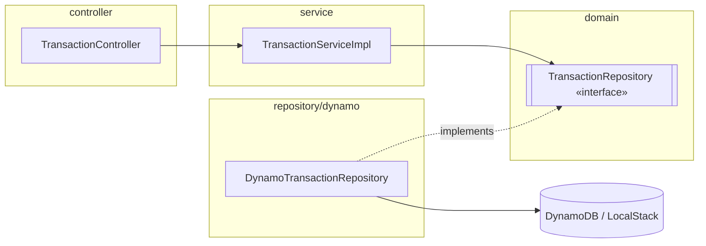

# Transactions

Servicio REST en Spring Boot que almacena transacciones (tipo + monto), las
vincula entre sí vía `parent_id`, y calcula la suma transitiva de todas las
transacciones conectadas (descendientes) a una transacción dada.

## Cómo levantar todo

```bash
docker-compose up --build
```

Esto levanta LocalStack (DynamoDB) y la aplicación en `http://localhost:8080`.
La tabla `transactions` y sus índices secundarios (`type-index`,
`parent-index`) se crean automáticamente al arrancar la app si no existen.

Endpoints:

```
PUT  /transactions/{id}            { "amount": double, "type": string, "parent_id": long? }
GET  /transactions/types/{type}    -> [ id, id, ... ]
GET  /transactions/sum/{id}        -> { "sum": double }
```

## Cómo correr los tests

Requiere Java 17 y Docker (los tests de integración levantan LocalStack real
vía Testcontainers).

```bash
mvn test
```

Incluye:

- Tests unitarios de `TransactionServiceImpl` con Mockito (sin contexto de
  Spring).
- Tests de integración de `DynamoTransactionRepository` contra un LocalStack
  real (Testcontainers).
- Tests end-to-end (`@SpringBootTest` + `MockMvc`) contra los endpoints REST
  reales, también contra LocalStack, cubriendo:
  - el ejemplo del PDF (10 → 11 → 12),
  - un `parent_id` huérfano,
  - una referencia cíclica entre transacciones.

## Cómo activar los git hooks

```bash
git config core.hooksPath .githooks && chmod +x .githooks/pre-commit
```

El hook de pre-commit corre `mvn spotless:check` y bloquea el commit si hay
violaciones de formato, sugiriendo `mvn spotless:apply`.

## Decisiones de diseño

### La suma es del subárbol de descendientes, no del componente conexo

`GET /transactions/sum/{id}` suma la transacción pedida más **todos sus
descendientes transitivos** (bajando por `parent_id`), pero nunca sube a
mirar su padre. Esto es explícito en el ejemplo del enunciado:

```
PUT /transactions/10 { "amount": 5000, "type": "cars" }
PUT /transactions/11 { "amount": 10000, "type": "shopping", "parent_id": 10 }
PUT /transactions/12 { "amount": 5000, "type": "shopping", "parent_id": 11 }

GET /transactions/sum/10  => {"sum": 20000}   // 5000 + 10000 + 5000
GET /transactions/sum/11  => {"sum": 15000}   // 10000 + 5000, sin el padre (10)
```

Si `sum(11)` incluyera al padre (10), daría 20000, no 15000 — el enunciado
confirma que la relación `parent_id` solo se recorre hacia abajo (hijos), no
hacia arriba. El cálculo es un BFS/DFS **iterativo** partiendo de la
transacción pedida, consultando `parent-index` para encontrar hijos
directos, con un `visited` set para no reprocesar un id ya sumado — esto
además evita un loop infinito si alguna vez se crea una referencia cíclica
entre `parent_id`s.

### GSI en vez de Scan

Un `Scan` sobre toda la tabla para filtrar por `type` o por `parent_id`
tiene costo lineal en el tamaño total de la tabla, sin importar cuántos
resultados matcheen — no escala y en DynamoDB además es notablemente más
caro que una Query (lee y cobra por *todos* los ítems escaneados, no solo
los que matchean el filtro). Para el volumen de datos esperado en este
challenge un `Scan` funcionaría, pero el patrón de acceso (buscar por tipo,
buscar hijos de un padre) es exactamente el caso de uso que un GSI resuelve
de forma nativa y con costo proporcional a los resultados, no al tamaño de
la tabla. Se optó por dos GSIs:

- `type-index` (PK `type`, projection `KEYS_ONLY`): solo necesitamos los
  `id`s de las transacciones de un tipo dado.
- `parent-index` (PK `parent_id`, projection `ALL`): necesitamos el `amount`
  de cada hijo directo para sumarlo sin tener que hacer un `GetItem`
  adicional por cada hijo encontrado.

### Por qué `TransactionRepository` vive en `domain/`



La flecha de dependencia va de `service` hacia la interfaz en `domain`, y
`DynamoTransactionRepository` apunta hacia esa misma interfaz para
implementarla — el dominio nunca apunta hacia `repository/dynamo`. Esto
sigue el principio de **Dependency Inversion**: el dominio (y el
`TransactionService`, que depende de esta interfaz) no debe conocer que la
persistencia es DynamoDB; `DynamoTransactionRepository` es un detalle de
infraestructura que implementa el contrato que el dominio define, no al
revés. Esto permite, por ejemplo, reemplazar DynamoDB por otro motor de
persistencia sin tocar el dominio ni el service, y facilita testear
`TransactionServiceImpl` con un mock de la interfaz sin levantar
infraestructura real.

### `parent_id` huérfano

`PUT` no valida que `parent_id` exista al momento de la escritura: se
acepta como referencia potencialmente "huérfana", ya que no hay orden
garantizado de llegada (el hijo puede llegar antes que el padre). No es un
error 400/404. El cálculo de la suma nunca necesita resolver el padre hacia
arriba, así que una referencia huérfana no afecta el resultado de `sum` de
ninguna transacción existente — simplemente esa transacción no tiene padre
"real" en la tabla, lo cual es indistinguible (a los efectos de este
challenge) de no tener padre.

### Referencia cíclica

Si dos o más transacciones llegaran a formar un ciclo de `parent_id` (p.ej.
A es padre de B y B es padre de A, algo que el `PUT` no impide porque no
valida existencia de `parent_id` ni mucho menos ciclos), el cálculo de suma
mantiene un `visited` set de ids ya procesados: si al bajar por el árbol se
vuelve a encontrar un id ya visitado, no se vuelve a sumar ni a encolar.
Esto garantiza que el algoritmo termina y que cada transacción se suma
exactamente una vez, incluso ante un ciclo.

### `sum` de un id inexistente

`GET /transactions/sum/{id}` para un id que nunca se hizo `PUT` devuelve
`404 Not Found` (vía `TransactionNotFoundException`), tratándolo como un
recurso que no existe — semántica REST estándar, distinta de los errores de
negocio genéricos (`DomainException` → `422`).
